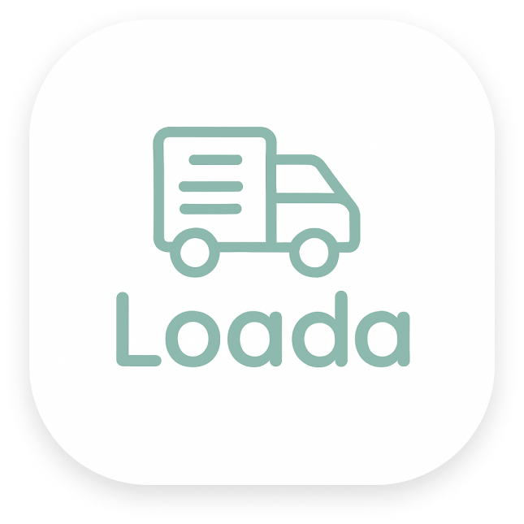
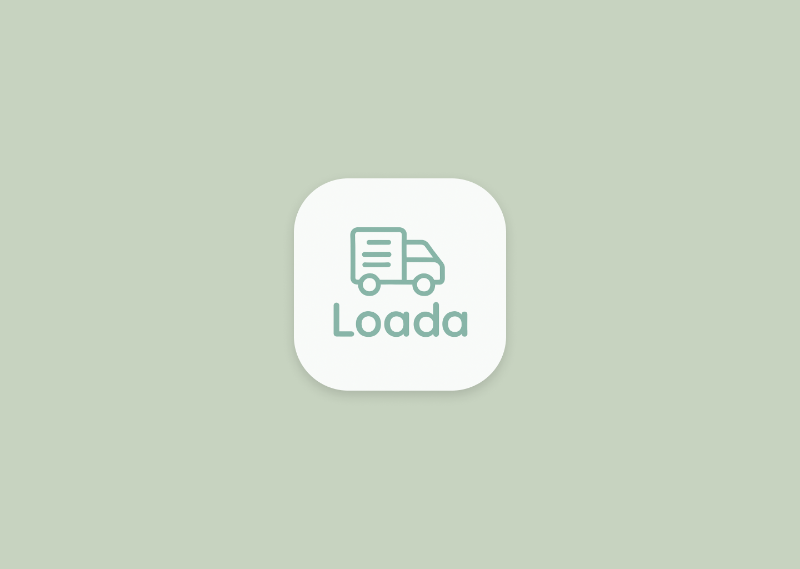
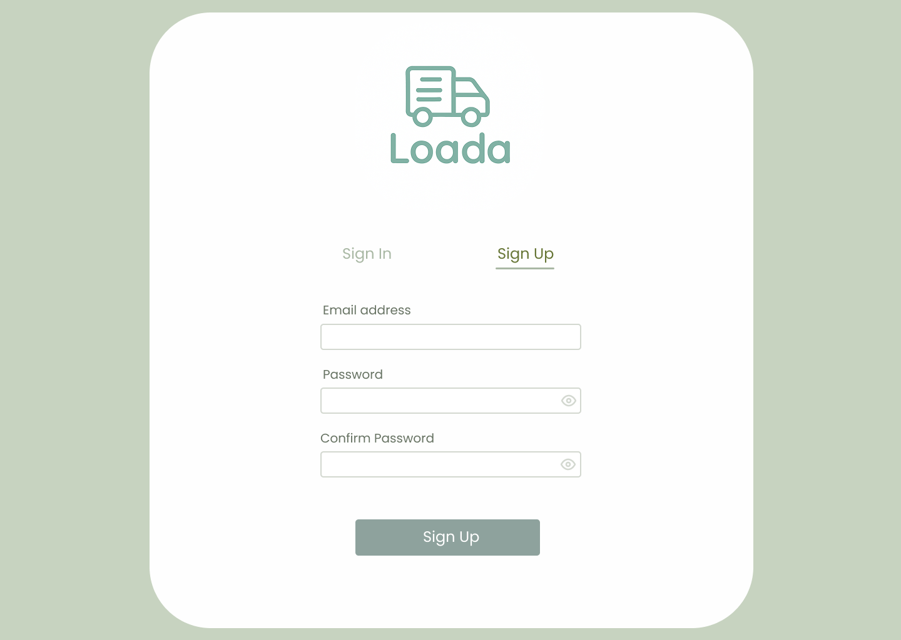
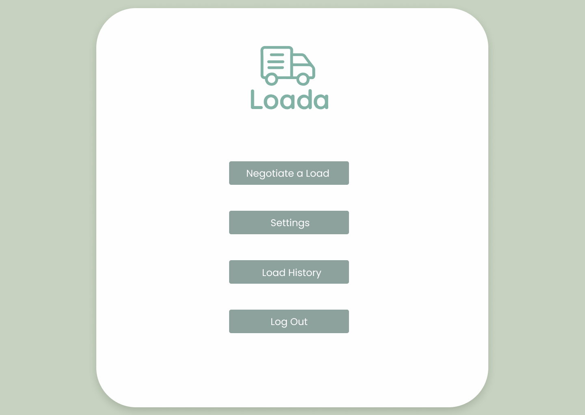
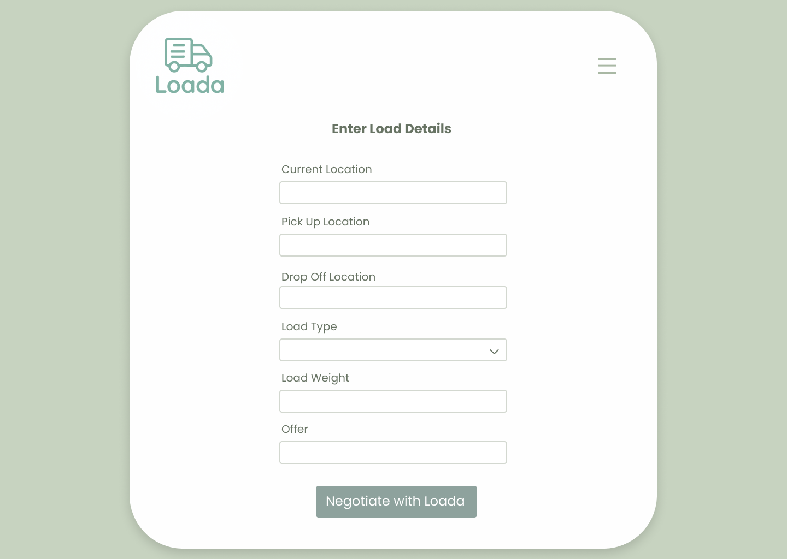
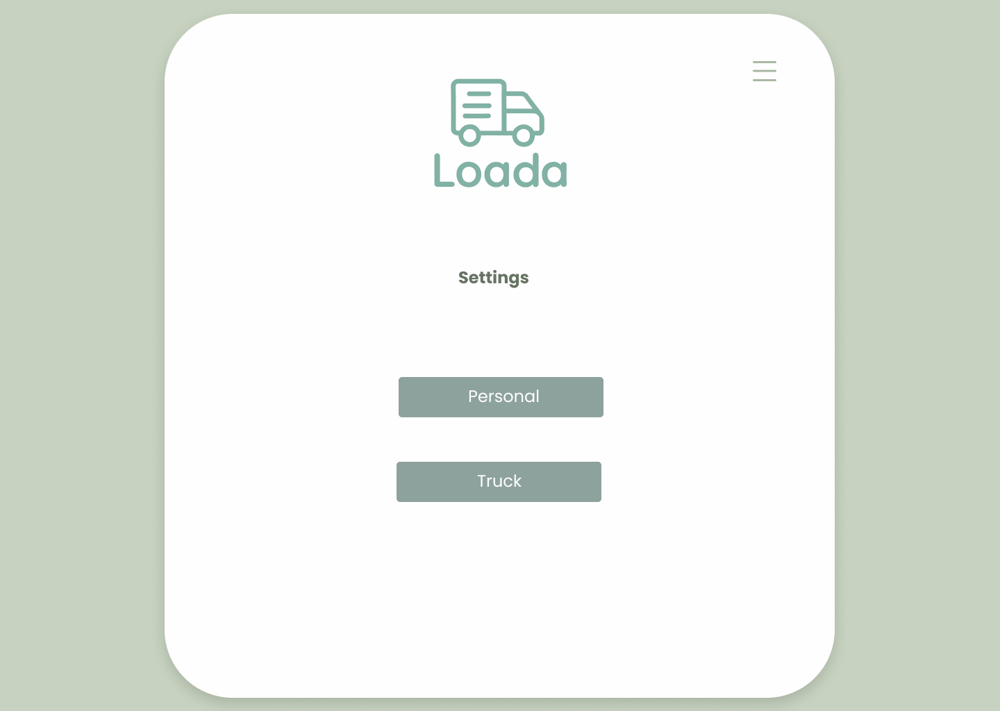
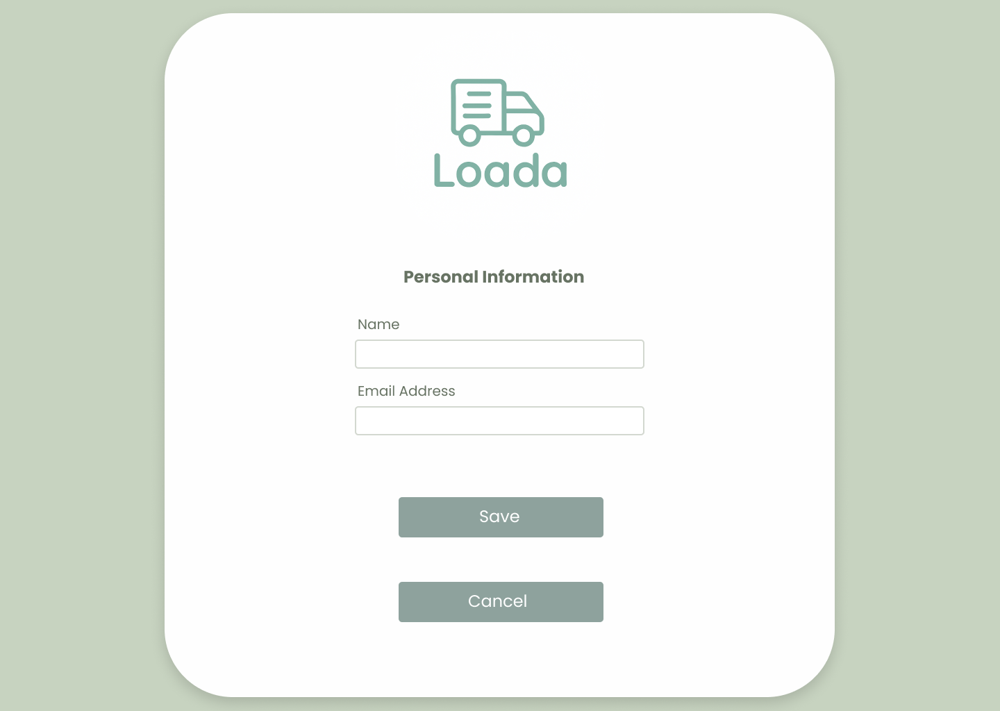
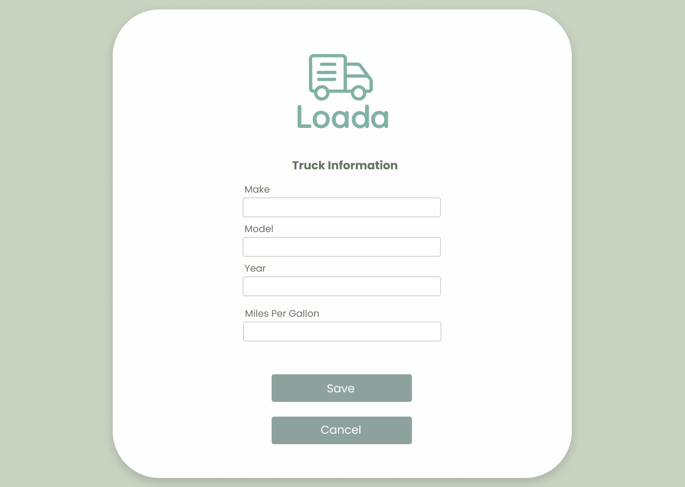
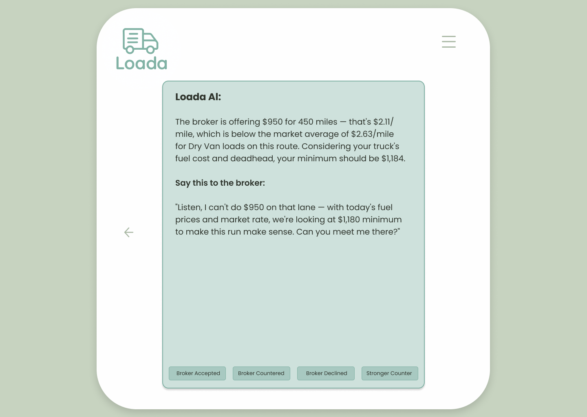

<p align="center">
  
</p>

# Loada.ai

 **Loada.ai – AI-Powered Freight Negotiation Web App (Still Under Development)**

Loada.ai is an intelligent, serverless web application that empowers truckers and freight dispatchers to evaluate and negotiate loads with data-backed insights and AI-driven guidance. Designed with real-world logistics challenges in mind, Loada combines load economics, live diesel prices, GPS-based deadhead calculations, and simulated freight market rates to help users make smart decisions fast.

## Screenshots
<p align="center">
  
</p>
<p align="center">
  
</p>
<p align="center">
  
</p>
<p align="center">
  
</p>
<p align="center">
  
</p>
<p align="center">
  
</p>
<p align="center">
  
</p>
<p align="center">
  
</p>

## Features
- **Mileage & Deadhead**: Automatic distance calculation using Google Maps API.  
- **Fuel Cost Estimation**: Real-time diesel prices (EIA API) + truck MPG + load weight.  
- **Profitability Analysis**: Compare broker offers against simulated DAT market rates.  
- **Loada AI Negotiator**: GPT-powered chat assistant that generates counteroffers and broker messaging.  
- **Secure Authentication**: AWS Cognito with password recovery and token-based access.  
- **Cloud-Native Backend**: Serverless design with AWS Lambda, API Gateway, DynamoDB.  
- **Clean Responsive UI**: Built with React + TypeScript + TailwindCSS + ShadCN, optimized for desktop and mobile.  

## Tech Stack
- **Frontend:** React.js (TypeScript), TailwindCSS, ShadCN  
- **Backend:** Python (FastAPI)  
- **Database:** AWS DynamoDB (NoSQL, precision with Decimal types)  
- **Authentication:** AWS Cognito  
- **APIs:**  
  - Google Maps API (Geolocation, Distance Matrix)  
  - EIA Fuel Price API (Diesel by U.S. state)  
  - GPT API (Negotiation assistant)  
  - Simulated DAT API (freight market rates)  
- **Deployment:** AWS Lambda, API Gateway, CloudFront  
- **Design:** Figma (UI/UX prototypes)  

## Future Development
- **Machine Learning Engine:** Train models on historical load data to provide predictive profitability analysis.
- **Custom AI Bot:** Beyond GPT API — build a proprietary negotiation bot trained specifically on freight industry datasets.
- **Expanded Market Data:** Integrate real DAT or FreightWaves APIs for real-time broker rates.
- **Mobile App Version:** Cross-platform app for iOS and Android (React Native or Flutter).

## 🚀 Getting Started (Dev)
```bash
# Clone repo
git clone https://github.com/liscontoli/Loada.git
cd Loada

# Install backend dependencies
cd backend
pip install -r requirements.txt

# Install frontend dependencies
cd ../frontend
npm install

# Run backend (FastAPI)
uvicorn main:app --reload

# Run frontend (React)
npm run dev